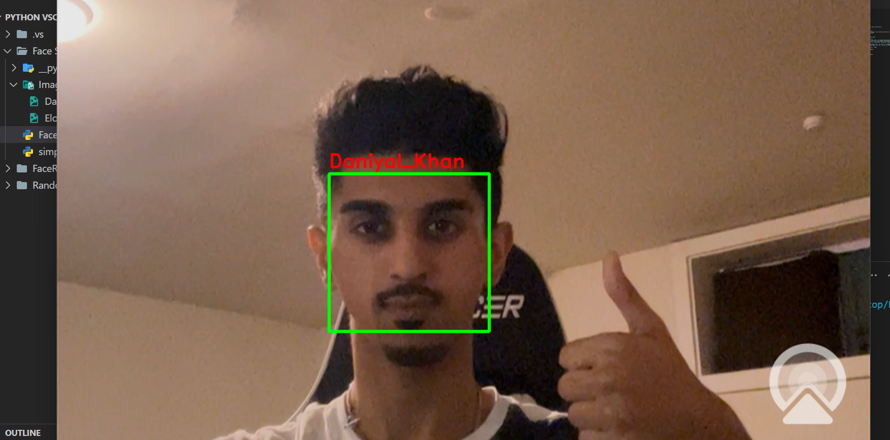
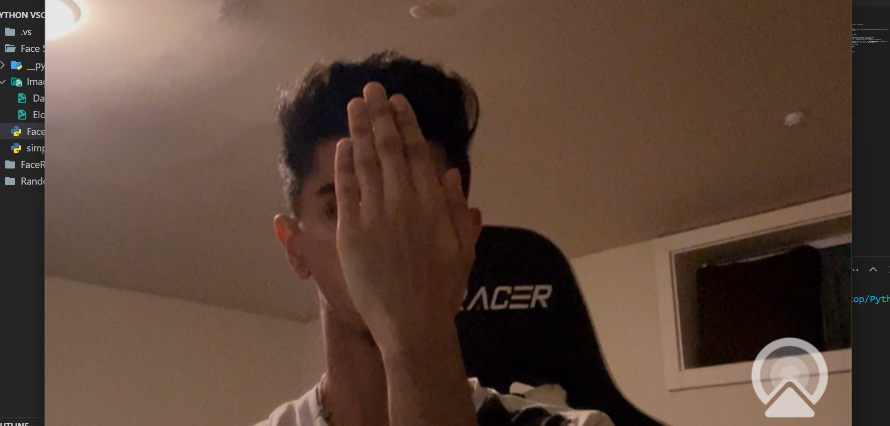

# Real-time Face Recognition

## Overview
This project utilizes the OpenCV library and a simple face recognition module to perform real-time face recognition using a webcam. It loads pre-encoded face images and detects known faces in the video stream.

## Calculations
### Successful Face Detection
- **Scenario:**
  - I showed a clear image of myself into the webcam so that the frame can detect my face
- **Screenshot:**
  

### Unsuccessful Face Detection
- **Scenario:**
  - I covered my face to show that the frame could not detect my face at all
- **Screenshot:**
  

## What I Learned
In the process of developing this project, I gained hands-on experience and knowledge in the following areas:

- Real-time video processing using OpenCV.
- Face recognition techniques, encodings, and built-in library functions
- Working with webcam input in Python.
- Structuring and organizing a simple Python project.
## Code Explanation
  - [SimpleFace](simple_facerec.py) is a python file that implemented a simpleface class that had functions to detect encodings and known faces
  - [Face Recognizer](FaceRecognizer.py) is a python file that imports simpleface and uses its object for the process of detecing faces.
    
## Features
- **Face Encoding:** Encodes known faces for recognition.
- **Real-time Detection:** Detects known faces in real-time using a webcam.
- **Visualization:** Displays the video stream with recognized faces highlighted.

## Installation
1. pip install opencv-python
2. pip install face_recognitions

## Configurations
- sfr.load_encoding_images('path/to/known_faces')  <- Change this path to the location of your images

